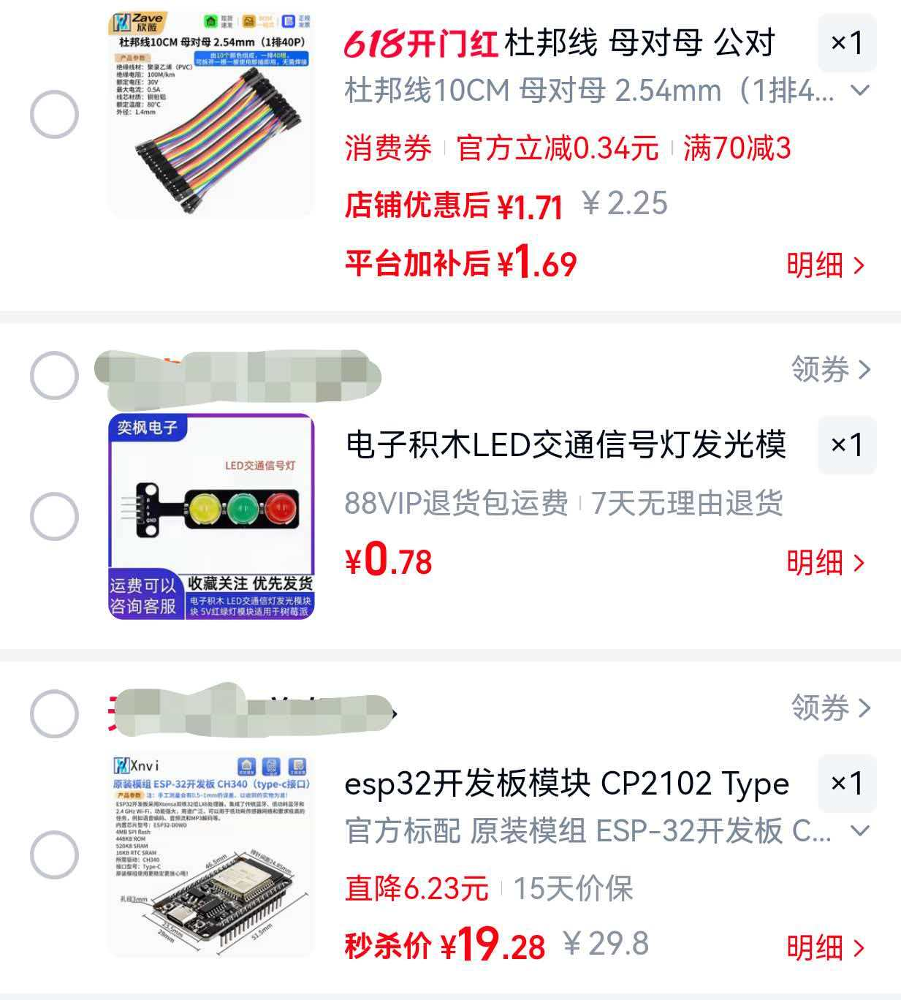

# Agent Light

[中文版](README.zh-CN.md)

Turn an Arduino traffic-light module into a real-time status indicator for Claude Code.

| State         | Light                |
|---------------|----------------------|
| Idle          | Green solid          |
| Thinking      | Chase (绿→黄→红跑马灯) |
| Running tools | Red blink            |
| Tool error    | Red fast blink       |
| Needs attention | Red/yellow alarm    |

## Prerequisites

- Node.js 18+ (run `npm install` after copying the project — pulls in serialport)
- An Arduino with a traffic-light LED module connected via USB serial
- Close the Arduino IDE serial monitor before starting the bridge

> No hardware? Jump to [Software-Only Version](#software-only-version-no-hardware-required).

## 快速安装（在新电脑上 / 分享给朋友）

前提：装好 [Node.js 18+](https://nodejs.org/)，插上已刷固件的 ESP32-C3 红绿灯（原生 USB，Win10/11 免驱）。

1. 把整个项目文件夹拷到对方电脑（git clone / 复制 / zip 均可，放哪个盘都行）
2. 双击 **`install.bat`**，按提示选择要接入的 AI CLI，脚本会自动：
   - 安装依赖（serialport）
   - 写入所选 CLI 的 hooks 配置（自动使用本机路径，与已有 hooks 共存，写入前自动备份）
   - 配置桥进程开机自启
   - 启动桥并发送测试命令（灯亮绿色即成功）
3. 想改配置或诊断问题：`node control.mjs`（控制台：启停桥 / 灯效测试 / 状态诊断）

> ChatGPT Desktop（Codex）注意：hooks 信任状态每次重启应用后会重置，
> 需在 设置 → 钩子 页面重新信任，这是 Desktop 的机制，无法绕过。

> 要给别人做一盏新灯（而不是直接把你手上这盏给他）？看
> [ESP32-C3 固件烧录指南](docs/FIRMWARE_GUIDE.md)——硬件清单、接线、
> Arduino IDE 设置、烧录、验证一站式说明，拿到零件即可照做。

### Hardware



## Quick Start

### 1. Start the bridge

```sh
npm run bridge
```

The bridge auto-detects the Arduino serial port. To specify one manually:

```sh
npm run bridge -- --serial /dev/cu.usbmodem832101
```

### 2. Wire up Claude Code hooks

Merge [`claude-settings-snippet.json`](claude-settings-snippet.json) into your `~/.claude/settings.json`. Update the path inside the snippet to match where you cloned this repo.

Hook events used:

- **UserPromptSubmit** — yellow blink (thinking)
- **PreToolUse** — red blink (running)
- **PostToolUse** — yellow blink (back to thinking)
- **Stop** — green solid (idle)

### 3. Test manually

```sh
npm run light -- idle
npm run light -- thinking
npm run light -- running
npm run light -- Y:blink:700
npm run light -- R:on
```

## Command Format

Named states: `idle`, `thinking`, `running` (plus aliases like `green`, `yellow`, `red`, `busy`, `think`).

Direct commands: `{G|Y|R}:{on|off|blink}[:{ms}]` — e.g. `Y:blink:700`, `R:on`, `G:off`.

Blink intervals must be between 50 and 10000 ms.

## Configuration

### Bridge options

| Flag        | Env var                | Default  |
|-------------|------------------------|----------|
| `--serial`  | `CLAUDE_LIGHT_SERIAL`  | auto     |
| `--baud`    | `CLAUDE_LIGHT_BAUD`    | 9600     |
| `--listen`  | `CLAUDE_LIGHT_PORT`    | 8765     |
| `--initial` | `CLAUDE_LIGHT_INITIAL` | idle     |

### Override default light patterns

| Env var                    | Example       |
|----------------------------|---------------|
| `CLAUDE_LIGHT_THINKING`    | `Y:on`        |
| `CLAUDE_LIGHT_RUNNING`     | `R:blink:100` |
| `CLAUDE_LIGHT_THINKING_MS` | `700`         |
| `CLAUDE_LIGHT_RUNNING_MS`  | `100`         |

## Software-Only Version (No Hardware Required)

If you don't have an Arduino, you can use the built-in desktop GUI traffic light instead. It is built with Rust and [eframe](https://github.com/emilk/egui/tree/master/crates/eframe), rendering a virtual traffic light that floats on top of all windows with a transparent background.

It works by polling the file `/tmp/claude-traffic-light` for the current state (`red`, `yellow`, or `green`).

### Quick Start

```sh
cargo run
```

Then configure your Claude Code hooks to write the state to the file:

```sh
echo "yellow" > /tmp/claude-traffic-light   # thinking
echo "red"    > /tmp/claude-traffic-light   # running tools
echo "green"  > /tmp/claude-traffic-light   # idle
```

The window is always-on-top, borderless, and draggable — just click and drag to reposition it.

## Windows + ESP32-C3 串口版（无蓝牙）

复用本项目（agent-light）的 Claude Code hooks + 命令体系，驱动 **ESP32-C3 SuperMini + 玩具红绿灯挂件**（公共正极灯板）。弃用蓝牙，改用 USB 串口，稳定性和响应速度更好。

### 硬件接线

| 灯位 | 颜色 | ESP32-C3 引脚 |
|---|---|---|
| L1 | 绿灯 | IO2 |
| L2 | 黄灯 | IO3 |
| L3 | 红灯 | IO4 |

```
ESP32 3.3V -> 灯板 + / 原电池正极
ESP32 IO2  -> 220Ω -> L1 = 绿灯
ESP32 IO3  -> 220Ω -> L2 = 黄灯
ESP32 IO4  -> 220Ω -> L3 = 红灯
```

公共正极：GPIO 低电平 = 灯亮，高电平 = 灯灭（固件已反相，无需手动处理）。

### 1. 烧录固件

1. 用 Arduino IDE 打开 [`firmware/esp32c3-agent-light.ino`](firmware/esp32c3-agent-light.ino)。
2. 开发板选择 **ESP32C3 Dev Module**，端口选对应的 COM 口。
3. 关键设置：**USB CDC On Boot = Enabled**（这样 `Serial` 走 USB 虚拟串口，电脑才能看到 COM 口）。
4. 上传固件。串口监视器选 **115200**，按一下 RST，输入 `thinking` / `running` / `idle` 应能直接控制灯。

### 2. 安装依赖

```sh
npm install
```

（仅串口桥 `serial-bridge.mjs` 需要 `serialport` 包；`hook-client.mjs` 仍零依赖。）

### 3. 启动桥

```sh
npm run bridge
```

桥会自动检测 ESP32-C3 的 COM 口。检测不准时手动指定：

```sh
npm run bridge -- --serial COM5
```

看到 `connected to COMx` 与 `Listening on 127.0.0.1:8765`，且灯变绿（idle）即正常。**桥需保持运行**，关掉灯就不动了（但 Claude Code 不受影响）。

### 4. 手动测试

```sh
npm run light -- thinking
npm run light -- running
npm run light -- idle
npm run light -- Y:blink:700
```

### 5. 配置 Claude Code hooks

把 [`configs/claude-settings-snippet.json`](configs/claude-settings-snippet.json) 合并进你的 `~/.claude/settings.json`（Windows 即 `%USERPROFILE%\.claude\settings.json`），并把 `<项目根目录>` 替换为本仓库实际路径（或直接运行 `install.bat` 自动完成）。配置后重启 Claude Code，发一条 prompt，灯应随状态变化：提交时跑马灯（绿→黄→红） → 工具运行黄闪 → 工具出错红快闪 → 需要确认时红黄警灯 → 结束绿常亮。

> hooks 是用户级全局配置，因此**任意 CLI、任意目录下启动的 `claude`** 都会触发灯效。同一台机同时开多个 `claude` 会话会驱动同一盏灯，状态按最后到达的命令跳变。

### 桥选项

| Flag | Env var | Default |
|---|---|---|
| `--serial` | `CLAUDE_LIGHT_SERIAL` | auto |
| `--baud` | `CLAUDE_LIGHT_BAUD` | 115200 |
| `--listen` | `CLAUDE_LIGHT_PORT` | 8765 |
| `--initial` | `CLAUDE_LIGHT_INITIAL` | idle |

## Architecture

```
Claude Code hooks ──> hook-client.mjs ──TCP──> serial-bridge.mjs ──Serial──> Arduino
```

- **hook-client.mjs** — fire-and-forget TCP client, sends a single command then exits.
- **serial-bridge.mjs** — long-running TCP server that forwards commands to the serial port.
- **lib/commands.mjs** — shared command parsing and validation.

## License

MIT
